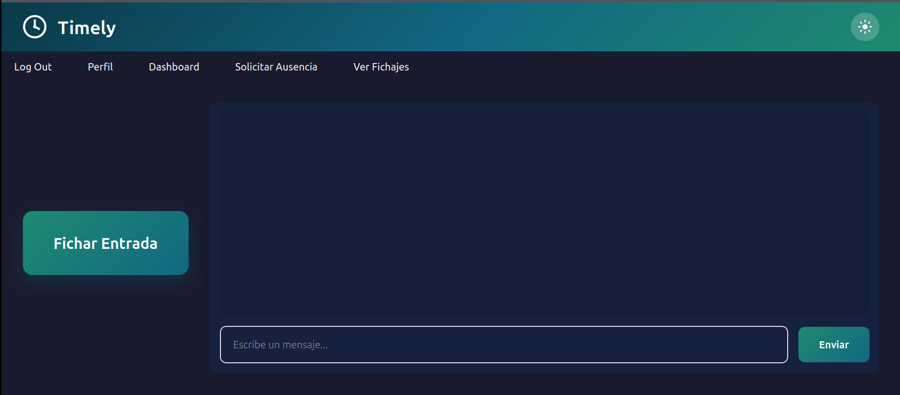
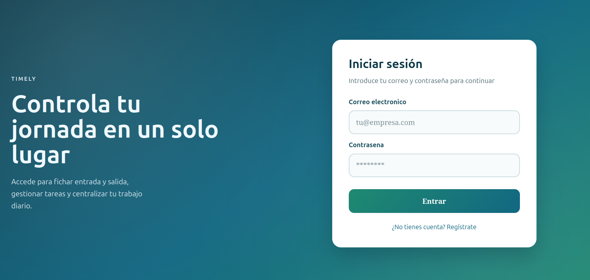
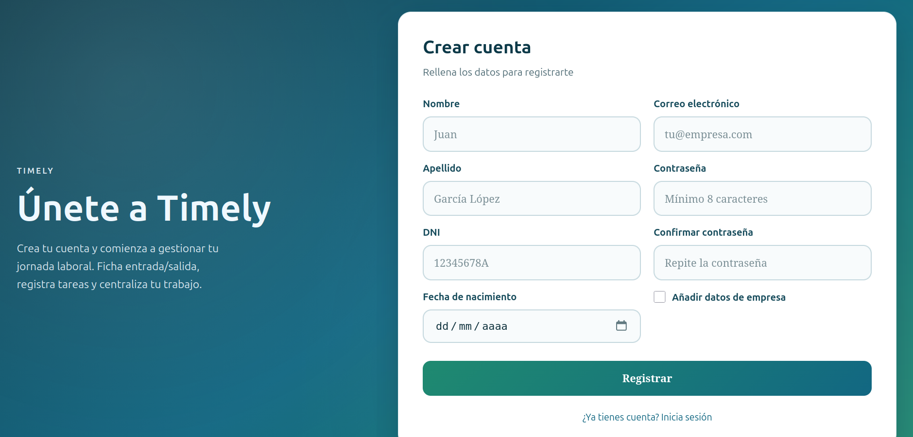
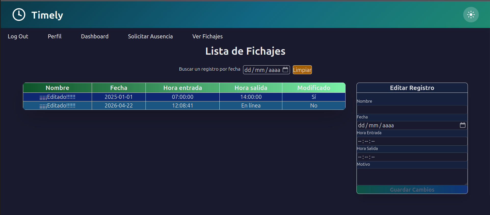
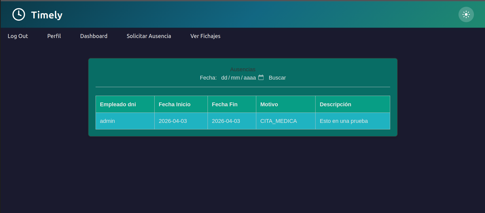

# 🕐 Timely - Sistema de Control de Jornada Laboral
## 🖼️ Capturas de Pantalla







## 📋 Descripción

**Timely** es una aplicación web para la gestión y control de jornadas laborales. Permite a los empleados fichar entrada y salida, gestionar sus datos personales y visualizar su historial de trabajo. Diseñada para empresas que buscan digitalizar y simplificar el control horario de sus trabajadores.

---

## 🛠️ Tecnologías Utilizadas

### **Frontend**
- **React** 19.2.4 - Biblioteca de JavaScript para construir interfaces de usuario
- **Vite** - Herramienta de desarrollo rápida para aplicaciones React
- **React Router DOM** 5.3.3 - Enrutamiento y navegación entre páginas
- **Axios** 1.13.6 - Cliente HTTP para comunicación con el backend
- **CSS3** - Estilos personalizados con variables CSS y diseño responsive

### **Backend**
- **Spring Boot** 4.0.2 - Framework de Java para desarrollo de APIs REST
- **Spring Data JPA** - Persistencia de datos con ORM
- **Hibernate** 7.2.1 - Mapeo objeto-relacional
- **MariaDB** 10.0.6+ - Base de datos relacional
- **Maven** - Gestión de dependencias y construcción del proyecto

### **Herramientas de Desarrollo**
- **Java** 
- **Node.js** (requerido para React)
- **MySQL**
- **Postman** - Pruebas de API 

---

## ⚙️ Requisitos Previos

Antes de instalar el proyecto, asegúrate de tener instalado:

- **Java JDK** 17 o superior ([Descargar aquí](https://www.oracle.com/java/technologies/downloads/))
- **Node.js** 16 o superior ([Descargar aquí](https://nodejs.org/))
- **MySQL Server** 5.7 o superior ([Descargar aquí](https://dev.mysql.com/downloads/))
- **Maven** (incluido con la mayoría de IDEs de Java)
- **Git** (para clonar el repositorio)

---

## 📦 Instrucciones de Instalación

### **1. Clonar el Repositorio**
```bash
git clone https://github.com/EndikaPM/Entrega-Proyecto-Intermodular
```

### **2. Configurar la Base de Datos**

#### Crear la base de datos en MySQL:
```sql
CREATE DATABASE Timely;
USE Timely;
```

#### Crear las tablas (ejecutar el script SQL):
Ejecuta el scrip adjunto

### **3. Configurar el Backend (Spring Boot)**


#### Configurar `application.properties`:
Edita `src/main/resources/application.properties`:

```properties
# Configuración de MySQL
spring.datasource.url=jdbc:mysql://localhost:3306/Timely
spring.datasource.username=root
spring.datasource.password=tu_password_mysql
spring.jpa.hibernate.ddl-auto=update
spring.jpa.show-sql=true

# Puerto del servidor
server.port=8081
```

#### Instalar dependencias y compilar:
```bash
mvn clean install
```

### **4. Configurar el Frontend (React + Vite)**

#### Navegar a la carpeta del frontend:
```bash
cd ../../frontend/FrontenTimely
```

#### Instalar dependencias:
```bash
npm install
```

---

## 🚀 Instrucciones de Ejecución
Inicia MySQL

### **1. Iniciar el Backend**

Desde la carpeta del backend:


## Desde tu IDE (IntelliJ)

Presiona ▶️ en la parte superior del IDE

### Ejecutar ProyectoTimelyApplication.java

El servidor arrancará en: `http://localhost:8081`


### **2. Iniciar el Frontend**

Desde la carpeta del frontend:

```bash
npm run dev
```

La aplicación se abrirá en: `http://localhost:5173` (o el puerto que indique Vite)

### **3. Acceder a la Aplicación**

Abre tu navegador y ve a `http://localhost:5173`

**Credenciales de prueba:**
- Email: `usuario.prueba1@gmail.com`
- Password: `usuario1`

---

## ✅ Funcionalidades Implementadas

### **Autenticación y Usuarios**
- ✅ **Login** - Inicio de sesión con email y contraseña
- ✅ **Registro** - Creación de nuevas cuentas de usuario
- ✅ **Edición de perfil** - Modificación de datos personales
- ✅ **Cierre de sesión** - Logout con limpieza de sesión

### **Interfaz de Usuario**
- ✅ **Modo oscuro/claro** - Toggle entre temas visuales
- ✅ **Navegación SPA** - Navegación fluida sin recargas de página
- ✅ **Diseño responsive** - Adaptable a diferentes tamaños de pantalla
- ✅ **Validación de formularios** - Feedback en tiempo real

### **Backend**
- ✅ **API REST** - Endpoints para usuarios y autenticación
- ✅ **Persistencia de datos** - Conexión con MySQL mediante JPA
- ✅ **Validación de credenciales** - Autenticación segura
- ✅ **CORS habilitado** - Comunicación frontend-backend
- ✅ **Fichar entrada/salida** - Registro de jornada laboral con botón
- ✅ **Historial de fichajes** - Visualización de fichajes anteriores
- ✅ **Filtrar Fichajes** - Visualización de fichajes Atraves de filtro fecha/nombre
- ✅ **Mensajería en tiempo real** - Chat con WebSocket/Socket.io
- ✅ **Editar Fichajes de usuario** - Editar jornada laboral con inputs y un botón
- ✅ **Los Admin y Jefes Tendran privilegios de Eliminar y editar** - Visualización de fichajes
anteriores para editarlos
- ✅ **Visualización de ausencias** - Vista de ausencias del equipo
- ✅**Gestión Empresa y departamento** - Crear y editar empresas
---

## 🚧 Funcionalidades Pendientes

### **Sistema de Maching Learning**
- ⏳**Generar una predición de ausencias futuras** - con una fecha 

### **Gestión de Ausencias**
- ⏳ **Registro de ausencias** - Vacaciones, bajas, permisos
### **Migración para facilitar el estilo**
- ⏳ **Migrar de CSS a TailwinCSS** - Por ahora solo tengo en Fichages List pero quiero migrar toda la app

---
## 🐞 Problemas conocidos

---
## 👨‍💻 Autor

**Nombre:** [Endika Pérez Más] 
**Curso:** [2º DAM]
**GitHub:** [https://github.com/EndikaPM]

---

## 📄 Licencia

Este proyecto es parte de un trabajo académico y está disponible únicamente con fines educativos.

---

<div align="center">

**Hecho usando React y Spring Boot**

</div>
